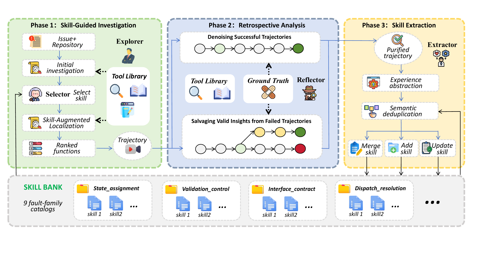

# EvoFL: Self-Evolving Fault Localization via Retrospective-Analysis-based Skill Distillation

## 📌 Introduction

EvoFL converts both successful and failed localization trajectories into reusable localization skills through ground-truth-guided retrospective analysis.

- **Successful trajectories:** EvoFL removes unreferenced observations, dead-end exploration, and redundant re-inspection, preserving only the diagnostic chain relevant to the ground-truth faulty entities.
- **Failed trajectories:** EvoFL retrospectively reflects on intermediate judgments and salvages valid analyses that narrow the investigation toward the fault, even when the final localization is incorrect.



## 📥 Inputs and Outputs

### Input: SWE-bench

EvoFL accepts a single SWE-bench instance together with its repository
snapshot. The required fields are:

| Field | Description |
|---|---|
| `instance_id` | SWE-bench instance identifier used as the stable run key. |
| `repo` | Repository name in `owner/repository` form. |
| `base_commit` | Buggy snapshot commit used to materialize the repository. |
| `problem_statement` | Issue description visible to the localization agent. |
| `patch` | Optional developer patch. It is used only after localization for retrospective learning or evaluation, and is never injected into Explorer. |

EvoFL can be connected to the official SWE-bench JSON/JSONL records or the
Hugging Face datasets:

```text
princeton-nlp/SWE-bench
princeton-nlp/SWE-bench_Lite
princeton-nlp/SWE-bench_Verified
```

To run an instance:

1. Load the SWE-bench record.
2. Materialize `repo` at `base_commit` if the repository snapshot is not already available locally.
3. Pass the issue text as `problem_statement` and the local repository path to EvoFL.
4. Keep `patch` outside the localization context. It can be supplied afterward when EvoFL performs retrospective analysis or when predictions are scored.

`function_ground_truth` is not a native SWE-bench field. It can be derived from
the old-side functions touched by `patch` when the record is used for
experience learning or function-level evaluation.

Other SWE-bench fields, such as `test_patch`, `FAIL_TO_PASS`, and
`PASS_TO_PASS`, may be retained in the input record but are not required by the
localization process.

### Outputs

For each SWE-bench instance, EvoFL produces:

```text
<run_dir>/
├── result.json
├── trajectory.jsonl
├── observations.jsonl
├── investigation_index.json
├── fault_skill_request.json
├── fault_skill_search.json
└── case_evolution/
    ├── supplementary/
    ├── investigation_conclusion.json
    ├── fault_reflector_output.json
    ├── applied_updates.json
    └── case_evolution_summary.json
```

| Output | Content |
|---|---|
| `result.json` | Final ranked suspicious functions, status, and summary. |
| `trajectory.jsonl` | Chronological reasoning, tool actions, observations, and Skill-loading events. |
| `observations.jsonl` | Exact tool responses delivered to the agent. |
| `investigation_index.json` | Compact investigation timeline with observation references. |
| `fault_skill_request.json` | Structured request used to select a relevant Fault Skill. |
| `fault_skill_search.json` | Fault-family routing, selector output, and validator decision. |
| `case_evolution/investigation_conclusion.json` | Evidence-supported conclusion from retrospective analysis. |
| `case_evolution/fault_reflector_output.json` | Candidate Skill update produced by the Reflector. |
| `case_evolution/applied_updates.json` | Actual `create`, `rewrite`, `preserve`, or `no_update` decision applied to the Skill Bank. |
| `case_evolution/case_evolution_summary.json` | Outcome, learning focus, and evolution status for the instance. |

Suspicious functions are ranked in descending order and use the following
identity format:

```text
relative/path/to/file.py::Class.method
```

The evolving Skill Bank is stored separately as JSONL. Each skill contains a
title, fault category, trigger, and a list of procedural knowledge statements.

## 🛠️ Environment Setup

EvoFL should be run in Linux or WSL with Python 3.10 or newer. The main runner
uses `fcntl`, so native Windows Python is not supported.

### 1. Clone the repository

```bash
git clone <repository-url> EvoFL
cd EvoFL
```

### 2. Create an environment

Using Conda:

```bash
conda create -n evofl python=3.10 -y
conda activate evofl
```

Or using `venv`:

```bash
python3 -m venv .venv
source .venv/bin/activate
```

### 3. Install the project

```bash
python -m pip install --upgrade pip
python -m pip install -e .
python -m pip install requests
```

### 4. Check the installation

```bash
PYTHONPATH=src python3 scripts/run_main.py --help
```

## 🚀 Quick Start

### 1. Configure the API

EvoFL uses an OpenAI-compatible Chat Completions API.

- `OPENAI_API_KEY`: API credential. This must be set before running the model-backed phases.
- `OPENAI_BASE_URL`: API base URL. Set this when using a provider other than the default OpenAI endpoint.
- `OPENAI_MODEL`: model identifier used by the provider.
- `EVOLUTEFL_SUPPORTS_TOOL_CHOICE=false`: optional compatibility switch for providers that support tools but reject an explicit `tool_choice` parameter.
- `GITHUB_TOKEN` or `GH_TOKEN`: optional GitHub credential used when repository metadata or source files are not already cached.

The configured endpoint must accept OpenAI-compatible requests at:

```text
{OPENAI_BASE_URL}/chat/completions
```

Do not write API keys or tokens into configuration files.

### 2. Run the experiment

```bash
export OPENAI_API_KEY="your-api-key"
export OPENAI_BASE_URL="https://your-provider.example/v1"
export OPENAI_MODEL="your-model-name"
export PYTHONPATH=src

python3 scripts/run_main.py \
  --phase full \
  --workers 4
```

`--workers` accepts values from `1` to `8`.

### 3. Output

All experiment outputs are written to:

```text
runs/main_experiment/
```

Completed cases are reused automatically when the runner is restarted.
