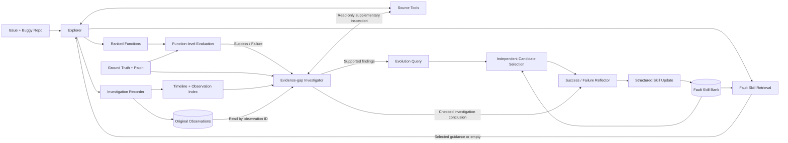

# EvoluteFL v5：论文框架图说明

本文描述当前实现，不代表已证明 Skill 带来定位提升。

## 核心思路

记录实际调查过程，通过只读补查定位证据缺口，将有观察支持的调查建议提炼为可复用 Fault Skill。

## 组件图



图中省略停止分支：Explorer 未完成不进化；补查 unresolved 不更新；协议/API/仓库错误单独记录。Reflector 也可选择 preserve 或 no_update。

## 各组件的输入、处理与输出

| 组件 | 实际机制 | 输出 |
|---|---|---|
| Explorer | 接收 issue、repo、base commit；通过 native tool calls 探索、加载一次 Skill、继续调查并结束 | 最多 5 个函数及简短证据总结 |
| Source Tools | `grep/read_file/find_symbol/read_symbol`；`read_observation` 回放已收到内容；`write` 仅用于实验笔记 | 带位置、分页/错误信息的源码观察 |
| Fault Skill Retrieval | Explorer 九类单路由；同类目录仅展示 ID/subtype/title/trigger；LLM selector 选一条或空；knowledge validator 再判断完整知识是否适用 | 最多一条 Skill，通过 role=tool 注入 |
| Investigation Recorder | 代码记录 purpose、based_on、observation_id、candidate_updates；保存实际交给模型的工具结果 | 完整日志、原始观察、紧凑调查索引 |
| Function-level Evaluation | patch 修改位置映射至函数；规范化预测函数标识，计算 Top-k 与 MRR | completed case 的 Top-5 hit/miss 标签 |
| Evidence-gap Investigator | 在同一缺陷仓库上回查原观察并补查源码，最多 16 次只读工具调用 | 原调查锚点、可用线索、补充观察、调查建议、未解决问题 |
| Evolution Query | 从经过补查的结论生成更新检索描述，独立重判 fault family | family + subtype query |
| Independent Candidate Selection | 合并运行时与补查后 family 的目录，按 skill_id 去重，独立选择候选，不绑定 Explorer 加载过的 Skill | 一条完整候选或空 |
| Fault Reflector | 成功/失败使用不同 prompt；从调查结论提炼可复用调查动作与区分证据 | create/rewrite/preserve/no_update |
| Skill Update | 校验输出结构、候选目标和 family 等协议，调用 SkillBank 更新 | 下一 case 可使用的新建/新版本 Skill |

## 定位与反思的边界

- 定位：模型不接收 ground truth、patch 或 mutation instance_id；没有测试执行。
- 反思：ground truth 和带来源/方向的 patch 只显式提供给补查阶段；Skill 写作阶段接收补查结论，而非直接拼入原始 patch。
- 结论可能包含具体源码证据，因此这不是对答案信息的完全隔离；其目的在于让 Skill 写作依据调查过程，而非直接改写补丁。
- SWE-smith 物化时将 clean-to-buggy patch 应用于独立仓库，并验证缺陷状态；补查前后校验仓库一致性，不将修复应用到被调查源码。
- 同一条 completed 轨迹按函数级 Top-5 判为成功或失败，无需配对两条轨迹；agent_interrupted 不属于学习样本。

## 轨迹如何进入反思

1. 每次工具调用记录简短目的、先前观察引用和可选候选判断；缺失的说明不由代码补造。
2. 原始工具输出完整留档，观察 ID 指向模型实际收到的内容；分页结果作为独立观察。
3. 代码生成全时间线索引，不额外调用总结 LLM；紧凑索引只保留关键字段，过长 purpose 截至 400 字符。
4. 补查 Agent 通过 `read_observation` 回读细节。原观察与补查观察使用不同 ID 命名空间。
5. resolved 结论要求有效的原观察锚点、实际回查和支持观察引用；这是引用/协议检查，不等同于语义正确性证明。

## Fault Skill 的组织

```text
九类 Fault Family（检索入口）
    -> retrieval_families 指向单个 skill_id（可有多个入口）
        -> 可动态创建的细分类 Skill
        -> title + trigger
        -> knowledge：无序调查建议列表
```

九类：missing_functionality、state_assignment、validation_control、interface_contract、transformation_representation、algorithm_computation、dispatch_resolution、lifecycle_timing_resource、environment_integration。

存储字段：`skill_id/status/version/skill_type/fault_family/retrieval_families/fault_subtype/skill`；`skill` 包含 `title/trigger/knowledge`。`fault_family` 是主类别，`retrieval_families` 是包含主类别的检索入口列表。多个入口共享同一 ID、知识和版本，新建与重写输出完整卡片，不复制多份 Skill。

Reflector 根据运行时问题表现和补查结论判断是否增删入口；分类不一致不会自动产生新入口。重写保持主类别和细类身份，preserve/no_update 不更改入口。旧记录读取时默认为只有主类别的入口，不自动重写历史库。

Explorer 仍只选一个 family、最多加载一条 Skill，selector 和 knowledge validator 继续检查适用性。目录含主类别和入口元数据，但不展开 knowledge。日志记录别名入口加载、反思目录合并及入口增删；这些记录用于后续检验是否改善召回，而非保证相关性。

当前 v5 不启用 Project Skill、Strategy Skill、Abstractor、旧 Insight、Builder 或 embedding 检索。运行时 knowledge validator 与反思侧调查 Agent 是不同职责。

## 当前安全边界

- Explorer 默认 30 步、900 秒；通常先做 1–3 次针对性探索，尚未加载时第 4 步要求 Fault 请求。
- 接近上限要求 native finish，并有有限 finalization 余量；这些是工程预算，不应画成方法的三阶段知识划分。
- Explorer 遇到 `finish_reason=length` 时不执行部分工具调用，在同一步以原 messages/tools 重试一次；重试预算至少 8192，官方 DeepSeek v4 仅该次请求关闭 thinking。正常轮次仍沿用原推理设置，其他 provider 不发送 DeepSeek 专属参数。再次截断记录 `response_truncated`，不伪造定位结果。
- `llm_trace.json` 保留每次尝试、输出上限和恢复开关；结果记录 LLM 请求数、截断数和恢复数。成功 DeepSeek 工具轮次回传 reasoning_content 作为协议历史，不将其作为源码观察。
- 每条 case 顺序进化，更新立即供下一条使用；效果评测应另外冻结 SkillBank，使用同样本无 Skill 对照。
- 证据支持的建议不等于已证实的准确率提升，仍需消融实验验证。

## 代码入口

- `src/evolutefl/explorer/v5_agent.py`
- `src/evolutefl/investigation.py`
- `src/evolutefl/reflection/v5_investigator.py`
- `src/evolutefl/reflection/v5_evolution.py`
- `src/evolutefl/evaluation/patch_ground_truth.py`
- `scripts/run_swesmith_case_by_case.py`
